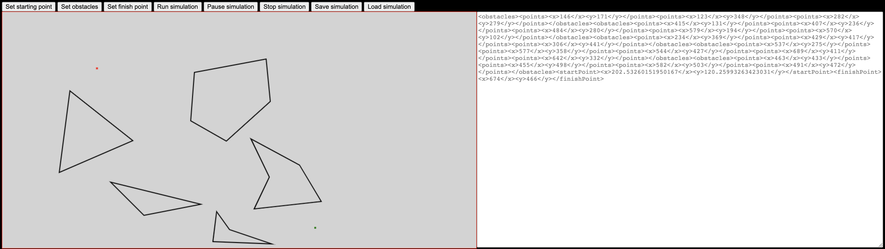

# Potential Function Path Planning


This project demonstrates an [Artificial Potential Field](https://en.wikipedia.org/wiki/Motion_planning#Artificial_potential_fields) path planning algorithm using JavaScript.

Users are capable of editing the obstacles, moving the start and finish points, and save/reload the state of the application.

## [ConfigCat](https://configcat.com/) Feature Flag
In an attempt to come up with a _not-so-artificial_ reason to use feature flags in this project I decided on providing an alternative format to save the state in.

### Feature flag on - XML format

```xml
<obstacles><points><x>146</x><y>171</y></points><points><x>123</x><y>348</y></points><points><x>282</x><y>279</y></points></obstacles><obstacles><points><x>415</x><y>131</y></points><points><x>407</x><y>236</y></points><points><x>484</x><y>280</y></points><points><x>579</x><y>194</y></points><points><x>570</x><y>102</y></points></obstacles><obstacles><points><x>234</x><y>369</y></points><points><x>429</x><y>417</y></points><points><x>306</x><y>441</y></points></obstacles><obstacles><points><x>537</x><y>275</y></points><points><x>577</x><y>358</y></points><points><x>544</x><y>427</y></points><points><x>689</x><y>411</y></points><points><x>642</x><y>332</y></points></obstacles><obstacles><points><x>463</x><y>433</y></points><points><x>455</x><y>498</y></points><points><x>582</x><y>503</y></points><points><x>491</x><y>472</y></points></obstacles><startPoint><x>202.53260151950167</x><y>120.25993263423031</y></startPoint><finishPoint><x>674</x><y>466</y></finishPoint>
```

### Feature flag off - JSON format

```json
{"obstacles":[{"points":[{"x":146,"y":171},{"x":123,"y":348},{"x":282,"y":279}]},{"points":[{"x":415,"y":131},{"x":407,"y":236},{"x":484,"y":280},{"x":579,"y":194},{"x":570,"y":102}]},{"points":[{"x":234,"y":369},{"x":429,"y":417},{"x":306,"y":441}]},{"points":[{"x":537,"y":275},{"x":577,"y":358},{"x":544,"y":427},{"x":689,"y":411},{"x":642,"y":332}]},{"points":[{"x":463,"y":433},{"x":455,"y":498},{"x":582,"y":503},{"x":491,"y":472}]}],"startPoint":{"x":202.53260151950167,"y":120.25993263423031},"finishPoint":{"x":674,"y":466}}
```